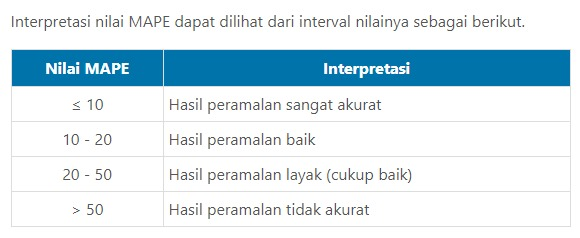
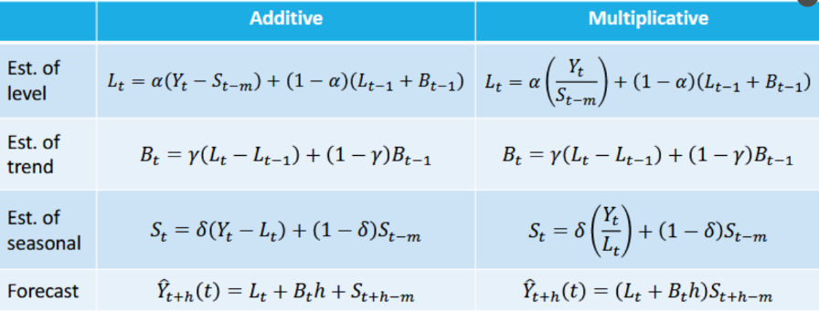
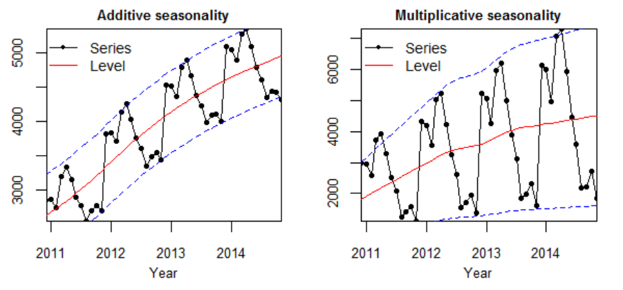

# i. Setting

Abaikan bagian ini. Lansung saja loncat ke `1. Tentang Data` .

### R Path Function

```{r}
path <- function(){
  gsub  ( "\\\\",  "/",  readClipboard ()  )
}
#Copy path
#Panggil function di console
#Copy r path, paste ke var yang diinginkan
```

```{r}
#Export chart
export.chart <- "C:/Users/Fathan/Documents/Obsidian Vault/2. Kuliah/Smt 5/6. Metode Peramalan Deret Waktu/@Proj/STA1341-MPDW/01/Chart"
```

### Install Load funcion

```{r}
#                      -=( Install & Load Package Function )=-
install_load <- function (package1, ...)  {   

   # convert arguments to vector
   packages <- c(package1, ...)

   # start loop to determine if each package is installed
   for(package in packages){

       # if package is installed locally, load
       if(package %in% rownames(installed.packages()))
          do.call('library', list(package))

       # if package is not installed locally, download, then load
       else {
          install.packages(package)
          do.call("library", list(package))
       }
   } 
}
```

### Theme 1

```{r}
install_load('ggplot2','extrafont')
# font_import(); loadfonts() #Run ini sekali aja
theme1 <- list(
  guides(fill="none"), #No Legends
  theme(
  text = element_text(size = 66),
  axis.title = element_text(size=33),
  axis.text.y = element_text(vjust = .5, face = "bold"),
  plot.title = element_text(hjust = 0.5),
  panel.background = element_rect(fill = 'transparent'),
  plot.background = element_rect(fill='transparent', color=NA),
  panel.grid.major = element_line(colour = "grey90"),
  axis.line = element_line(linewidth = 2, colour = "grey90"))
)
```

### Theme 2 - line plot

```{r}
# This theme extends the 'theme_minimal' that comes with ggplot2.
# The "Lato" font is used as the base font. This is similar
# to the original font in Cedric's work, Avenir Next Condensed.
install_load('ggtext')

## theme_set(theme_minimal(base_family = "Lato"))


theme_update(
  # Remove title for both x and y axes
  axis.title = element_blank(),
  # Axes labels are grey
  axis.text = element_text(color = "grey40"),
  # The size of the axes labels are different for x and y.
  axis.text.x = element_text(size = 20, margin = margin(t = 5)),
  axis.text.y = element_text(size = 17, margin = margin(r = 5)),
  # Also, the ticks have a very light grey color
  axis.ticks = element_line(color = "grey91", linewidth = .5),
  # The length of the axis ticks is increased.
  axis.ticks.length.x = unit(1.3, "lines"),
  axis.ticks.length.y = unit(.7, "lines"),
  # Remove the grid lines that come with ggplot2 plots by default
  panel.grid = element_blank(),
  # Customize margin values (top, right, bottom, left)
  plot.margin = margin(20, 40, 20, 40),
  # Use a light grey color for the background of both the plot and the panel
  plot.background = element_rect(fill = "grey98", color = "grey98"),
  panel.background = element_rect(fill = "grey98", color = "grey98"),
  # Customize title appearence
  plot.title = element_text(
    color = "grey10", 
    size = 28, 
    face = "bold",
    margin = margin(t = 15)
  ),
  # Customize subtitle appearence
  plot.subtitle = element_markdown(
    color = "grey30", 
    size = 16,
    lineheight = 1.35,
    margin = margin(t = 15, b = 40)
  ),
  # Title and caption are going to be aligned
  plot.title.position = "plot",
  plot.caption.position = "plot",
  plot.caption = element_text(
    color = "grey30", 
    size = 13,
    lineheight = 1.2, 
    hjust = 0,
    margin = margin(t = 40) # Large margin on the top of the caption.
  ),
  # Remove legend
  legend.position = "none"
)
```

# 1. Tentang Data

Dataset yang saya gunakan merupakan koleksi data harga saham historis periode Juli 2018 hingga Juli 2023 dari beberapa raksasa teknologi paling berpengaruh di dunia: Microsoft, Apple, Amazon, Nvidia, Google, Netflix, dan Meta (sebelumnya dikenal sebagai Facebook). Dataset ini menjadi sumber daya berharga bagi analis keuangan, ilmuwan data, dan penggemar pasar saham yang ingin menganalisis dan memahami tren harga perusahaan-perusahaan terkemuka di industri ini.

Dataset ini memilki data :

1.  **Open:** yakni Harga saham pada awal periode perdagangan tertentu. Ini adalah harga saham pertama pada hari perdagangan tersebut.
2.  **High:** Harga tertinggi yang saham capai selama periode perdagangan tersebut. Ini mencerminkan harga tertinggi yang pembeli bersedia bayar selama hari tersebut.
3.  **Low:** Harga terendah yang saham capai selama periode perdagangan tersebut. Ini mencerminkan harga terendah yang penjual bersedia terima selama hari tersebut.
4.  **Close:** Harga saham pada akhir periode perdagangan tertentu. Ini adalah harga saham terakhir pada hari perdagangan tersebut.
5.  **Adj Close (Adjusted Close):** Harga penutup yang telah disesuaikan untuk memperhitungkan perubahan seperti pembagian saham atau dividen. Ini adalah harga penutup yang paling relevan untuk analisis jangka panjang, karena mencerminkan harga saham yang sebenarnya setelah penyesuaian.
6.  **Volume:** Volume perdagangan saham selama periode tertentu. Ini mencerminkan jumlah saham yang diperdagangkan selama hari perdagangan tersebut.

Karena tugas kali ini hanya menggunakan satu peubah dan satu kategori saja. Maka kali ini saya akan menggunakan peubah `Adj Close (Adjusted Close)` .Karena `Adj Close` Adalah peubah yang paling sesuai untuk dianalisis dibandingkan peubah lainnya. Untuk pemilihan data sahamnya, saya ingin mengeksplorasi terlebih dahulu.

### Import Data

```{r}
install_load('rio')
raw.data <- import("https://raw.githubusercontent.com/Zen-Rofiqy/STA1341-MPDW/main/Data/MAANG%20Stock%20Prices.csv")
```

### Cleaning Data

Melihat tipe data.

```{r}
str(raw.data)
```

Cek Data kosong.

```{r}
sum(is.na(raw.data))
```

Tidak ada data kosong.

Semua tipe data masih berupa character. Harus diubah menjadi tipe data yang sesuai.

```{r}
install_load('dplyr')
data <- raw.data %>%  
  mutate(
    Date = as.Date(raw.data[, 2], format = "%m/%d/%y"), #Mengubah menjadi Date 
    across(3:ncol(raw.data), as.numeric)                #Mengubah menjadi Numerik
  )
str(data)
```

Ternyata ada data kosong. Harus cek ulang.

```{r}
# Mencari indeks baris dan kolom yang mengandung NA
na.idx <- which(is.na(data), arr.ind = TRUE)

# Menampilkan data raw dengan baris dan kolom yang mengandung NA
install_load('kableExtra','dplyr')
kable(raw.data[                        # Subsetting
                unique(na.idx[, 1]),   # Vektor indeks baris yang mengandung NA
                unique(na.idx[, 2])  ] # Vektor indeks kolom yang mengandung NA
      ) %>% kable_styling()            # Style Tabel
```

Ternyata pada baris tersebut ada data karakter text. Sehingga ketika diubah ke numerik akan menjadi `NA`. Maka saya akan menghapus baris tersebut.

```{r}
data <- data %>%
  filter(!row_number() %in% unique(na.idx[, 1]))
```

### Time Series MAANG

```{r dpi=300, fig1, fig.height = 9, fig.width = 16, fig.align = "center"}
install_load('viridis','ggrepel')
#Plot
cts.maang <-
ggplot(data, aes(x=Date, y=`Adj Close`)) + #Data
  geom_line(aes(color=Name), linewidth=1) + #Timeseries
  #Color
    scale_color_viridis(alpha = 0.75, #Opacity
                     begin = 0, #Color pallte scale begins
                     end = 0.9, #Color pallte scale ends
                     direction = -1, #Flip color scale
                     discrete = T, #Discrete Value
                     option = "D") + #Color Palette
  theme1 + #THeme
  labs(x = "Tahun", y = "Harga Saham (USD)") + #Label X & Y
  # Label / legend
  geom_text_repel(
    data=data[data$Date == max(data$Date),], #Posisi di ujung data
    aes(color = Name, label = Name), #Warna garis & label saham
    size = 8, #Ukuran text
    nudge_x = 80, #Posisi Text (kanan 50)
    hjust = 0, #Ujung
    segment.size = 1,               #Ukuran garis
    segment.alpha = .75,             #transparasi garis
    segment.linetype = "dotted",    #Time garis
    box.padding = .4, #Biar label saham nggak dempetan
    segment.curvature = -0.1, #biar garis mulus
    segment.ncp = 8, 
    segment.angle = 60 
  ) +
  #Axis
    coord_cartesian(clip = "off"
  ) +
    scale_x_date( #Sumbu x
    date_breaks = "1 year",  # Menampilkan label setiap tahun
    date_labels = "%Y",  # Format label tahun
    limits = c(as.Date("2018-07-30"), as.Date("2023-12-28"))
    #Tampilin lebih dari 20023-07-28 agar label saham bisa masuk
  ) +
    scale_y_continuous( #Sumbu y
    labels = scales::dollar_format(prefix = "$") #tambahin dolar
  ) +
    annotate( #Buat nandain batas data
    "text", x = as.Date("2023-7-28"), y = 50, 
    label = "28 Juli", size=6
  ) +
  geom_vline( #Buat garis batas data
    xintercept = as.numeric(as.Date("2023-07-28")), 
             linetype = "dotted", color = "red")
cts.maang

#Export Chart
ggsave("01_Time Series MAANG.png", cts.maang, path = export.chart,
        dpi = 300, height = 9, width = 16)
```

Jika dilihat dari tahun `2019-2022`, semua saham cenderung memiliki pola trend naik. Lalu dari `2021-2023` polanya cenderung trend turun. Untuk tugas praktikum kali ini, saya hanya akan menggunakan rentang tahun `2022-2023` dengan tren cenderung turun. Agar pengerjaannya tidak terlalu sulit, karena masih tahap awal pembelajaran.

Ada yang menarik perhatian saya. Kenapa dulu Pendiri Amazon, Jeff Bezos yang pernah menjadi orang terkaya di dunia pada tahun `2017` lalu, harga saham sekarang tidak setinggi yang saya kira?. Oleh karena itu saya memutuskan untuk menggunakan data saham `Amazon` untuk praktikum kali ini.

```{r}
amzn <- data %>%
  select(1, 2, 7) %>%  # Memilih kolom 1, 2, dan 7
  filter(Name == "AMZN", Date >= as.Date("2022-01-01"))  # Filter data saham Amazon tahun 2022 ke atas

rownames(amzn) <- NULL
str(amzn)
```

```{r}
kable(amzn) %>% kable_styling()
```

Mengubah `Ajd Close` Menjadi *Time series*

```{r}
amzn.ts <- ts(amzn[,3])
```

Ringkasan Data `Ajd CLose`

```{r}
summary(amzn.ts)
```

### Time Series Amazon

Cara manual

```{r dpi=300, fig1, fig.height = 9, fig.width = 16, fig.align = "center"}
ts.plot(amzn.ts, xlab="Time Period", ylab="Harga Saham", 
        main = "Time Series Amazon", col='orange', lwd=2)
points(amzn.ts, col='orange', lwd=1.5)
```

```{r}
# Membuka file PNG untuk menyimpan plot
png("C:/Users/Fathan/Documents/Obsidian Vault/2. Kuliah/Smt 5/6. Metode Peramalan Deret Waktu/@Proj/STA1341-MPDW/01/Chart/02_Time Series Amazon.png",
    height = 9*300, width = 16*300, res=300)

# Plot time series dengan warna dan pengaturan lainnya
ts.plot(amzn.ts, xlab = "Time Period", ylab = "Harga Saham",
        main = "Time Series Amazon", col = 'orange', lwd = 2)
points(amzn.ts, col = 'orange', lwd = 1.5)

# Menyimpan plot sebagai file PNG
dev.off() # Menutup file PNG
```

Agar lebih menarik, saya coba menggunakan ggplot2. Dengan ggplot2, tipe data tidak perlu dibuah ke Time Series dulu.

```{r dpi=300, fig1, fig.height = 5, fig.width = 10, fig.align = "center"}
cts.amzn <-
ggplot(amzn, aes(x=Date, y=`Adj Close`)) + 
  geom_line(aes(color=Name), linewidth=0.5) +
  scale_color_manual(values = c("cyan4")) +
  theme_minimal()
cts.amzn
#Export Chart
ggsave("03_Time Series Amazon_ggplot.png", cts.amzn, path = export.chart,
        dpi = 300, height = 5, width = 10)
```

Terlihat bahwa data berpola trend turun karena terjadi penurunan sekuler jangka panjang (perubahan sistematis selama periode waktu yang panjang) dalam data dan cendrung membentuk pola musiman. Oleh karena itu, metode pemulusan yang cocok adalah Double Moving Average (**DMA**), Double Exponential Smoothing (**DES**), dan Winter Aditif atau Winter Multiplikatif.

# 2. Pemulusan (Smoothing)

### Pembagian data

```{r}
#membagi 80% data latih (training) dan 20% data uji (testing)
training <- amzn[1: round(nrow(amzn) *80/100),]
testing <- amzn[round(nrow(amzn) *80/100): nrow(amzn),]
train.ts <- ts(training[,3])
test.ts <- ts(testing[,3])
```

### Eksplorasi Data

Eksplorasi data dilakukan pada keseluruhan data, data latih serta data uji menggunakan plot data deret waktu.

Menggunakan `ggplot2` .

```{r dpi=300, fig1, fig.height = 5, fig.width = 10, fig.align = "center"}
ggplot() + 
  geom_line(data = training, 
            aes(x = Date, y = `Adj Close`, col = "Data Latih")) +
  geom_line(data = testing, 
            aes(x = Date, y = `Adj Close`, col = "Data Uji")) +
  labs(x = "Periode Waktu", y = "Harga Saham", color = "Legend") +
  scale_colour_manual(name="Keterangan:", 
                      breaks = c("Data Latih", "Data Uji"),
                      values = c("orange", "cyan4")) + 
  theme_bw() + theme(legend.position = "bottom",
                     plot.caption = element_text(hjust=0.5, size=12))
```

## a. Double Moving Average (DMA)

Metode pemulusan Double Moving Average (**DMA**) pada dasarnya mirip dengan Single Moving Average (**SMA**). Namun demikian, metode ini lebih cocok digunakan untuk pola data trend. Proses pemulusan dengan rata rata dalam metode ini dilakukan sebanyak 2 kali.

```{r}
install_load('TTR')
data.sma <- SMA(train.ts, n=4)

dma <- SMA(data.sma, n = 4)
At <- 2*data.sma - dma
Bt <- 2/(4-1)*(data.sma - dma)
data.dma<- At+Bt
data.ramal2<- c(NA, data.dma)

t = 1:nrow(testing)
f = c()

for (i in t) {
  f[i] = At[length(At)] + Bt[length(Bt)]*(i)
}

data.gab2 <- cbind(aktual = c(train.ts,rep(NA, nrow(testing))), 
                   pemulusan1 = c(data.sma,rep(NA, nrow(testing))),
                   pemulusan2 = c(data.dma, rep(NA, nrow(testing))),
                   At = c(At, rep(NA, nrow(testing))), 
                   Bt = c(Bt,rep(NA, nrow(testing))),
                   ramalan = c(data.ramal2, f[-1]))
kable(data.gab2) %>% kable_styling() 
```

### Visualisasi hasil pemulusan menggunakan metode DMA

```{r dpi=300, fig1, fig.height = 9, fig.width = 16, fig.align = "center"}
ts.plot(amzn.ts, xlab="Time Period ", ylab="Average Price", 
        main= "DMA N=4 Data Saham Amazon Periode 2022-2023")
points(amzn.ts)
lines(data.gab2[,3],col="cyan4",lwd=2)
lines(data.gab2[,6],col="orange",lwd=2)
legend("topleft",c("data aktual","data pemulusan","data peramalan"), 
       lty=8, col=c("black","cyan4","orange"), cex=0.8)

```

### Perhitungan akurasi

Selanjutnya perhitungan akurasi dilakukan baik pada data latih maupun data uji. Perhitungan akurasi dilakukan dengan ukuran *Sum Squares Error* (`SSE`), *Mean Square Error* (`MSE`) dan *Mean Absolute Percentage Error* (`MAPE`).

```{r}
#Menghitung nilai keakuratan data latih

error_train.dma = train.ts - data.ramal2[1:length(train.ts)]
SSE_train.dma = sum(error_train.dma[8:length(train.ts)]^2)
MSE_train.dma = mean(error_train.dma[8:length(train.ts)]^2)
MAPE_train.dma = mean(abs((error_train.dma[8:length(train.ts)]/
                             train.ts[8:length(train.ts)])*100))

akurasi_train.dma <- matrix(c(SSE_train.dma, 
                              MSE_train.dma, MAPE_train.dma))
row.names(akurasi_train.dma)<- c("SSE", "MSE", "MAPE")
colnames(akurasi_train.dma) <- c("Akurasi m = 4")
akurasi_train.dma
```

Semakin kecil `SSE`, `MSE`, dan `MAPE` maka semakin akurat sebuah model dalam melakukan peramalan. Perhitungan akurasi pada data latih menggunakan nilai `MAPE` menghasilkan nilai `MAPE` diantara 10-20 sehingga nilai akurasi ini dapat dikategorikan baik. Selanjutnya, perhitungan nilai akurasi dilakukan pada data uji.

{width="370"}

```{r}
#Menghitung nilai keakuratan data uji

error_test.dma = test.ts - 
  data.gab2[nrow(training) : nrow(amzn),6]
SSE_test.dma = sum(error_test.dma^2)
MSE_test.dma = mean(error_test.dma^2)
MAPE_test.dma = mean(abs((error_test.dma/test.ts*100)))

akurasi_test.dma <- matrix(c(SSE_test.dma, MSE_test.dma, MAPE_test.dma))
row.names(akurasi_test.dma)<- c("SSE", "MSE", "MAPE")
colnames(akurasi_test.dma) <- c("Akurasi m = 4")
akurasi_test.dma
```

Perhitungan akurasi pada data uji menghasilkan nilai `MAPE` di antara 20-50 sehingga nilai akurasi ini dapat dikategorikan sebagai layak (cukup baik).

## b. Double Exponential Smoothing (DES)

Metode *Exponential Smoothing* adalah metode pemulusan dengan melakukan pembobotan menurun secara eksponensial. Nilai yang lebih baru diberi bobot yang lebih besar dari nilai terdahulu. Terdapat satu atau lebih parameter pemulusan yang ditentukan secara eksplisit dan hasil pemilihan parameter tersebut akan menentukan bobot yang akan diberikan pada nilai pengamatan.

Ada dua macam model, yaitu model tunggal dan ganda. Model tunggal atau Single Exponential Smoothing (**SES**) merupakan metode pemulusan yang tepat untuk data dengan pola stasioner atau konstan. Sedangkan model ganda atau Double Exponential Smoothing (**DES**) untuk data berpola tren. Data `harga saham amazon periode 2022-2023` cenderung berpola tren sehingga menggunakan metode pemulusan **DES**.

Metode pemulusan **DES** digunakan untuk data yang memiliki pola tren. Metode **DES** adalah metode semacam **SES**, hanya saja dilakukan dua kali, yaitu pertama untuk tahapan *'level'* dan kedua untuk tahapan *'tren'*. Pemulusan menggunakan metode ini akan menghasilkan peramalan tidak konstan untuk periode berikutnya.

Pemulusan dengan metode **DES** ini akan menggunakan fungsi `HoltWinters()` . Nilai argumen `beta` diinisialisasi bersamaan dengan nilai `alpha` dan nilai argumen `gamma` dibuat `FALSE`.

```{r dpi=300, fig1, fig.height = 9, fig.width = 16, fig.align = "center"}
install_load('forecast')
#beta=0.2 dan alpha=0.2
des.1<- HoltWinters(train.ts, gamma = FALSE, beta = 0.2, alpha = 0.2)
plot(des.1, lwd=2)

#ramalan
ramalandes1<- forecast(des.1, h= nrow(testing))     #h = panjang periode
kable(ramalandes1) %>% kable_styling()

#beta=0.3 dan aplha=0.6
des.2<- HoltWinters(train.ts, gamma = FALSE, beta = 0.3, alpha = 0.6)
plot(des.2, lwd=2)

#ramalan
ramalandes2<- forecast(des.2, h=nrow(testing))
kable(ramalandes2) %>% kable_styling()
```

Nilai `y` adalah nilai data deret waktu, `gamma` adalah parameter pemulusan untuk komponen musiman, `beta` adalah parameter pemulusan untuk tren, dan `alpha` adalah parameter pemulusan untuk stasioner, serta `h` adalah banyaknya periode yang akan diramalkan.

### Plot Data Latih dan Data Uji

Selanjutnya jika ingin membandingkan plot data latih dan data uji adalah sebagai berikut.

```{r dpi=300, fig1, fig.height = 9, fig.width = 16, fig.align = "center"}
#Visually evaluate the prediction
plot(amzn.ts)
lines(des.1$fitted[,1], lty=2, col="purple1", lwd=2)
lines(ramalandes1$mean, col="orange", lwd=2)
```

Untuk mendapatkan nilai parameter optimum dari **DES**, argumen `alpha` dan `beta` dapat dibuat `NULL` seperti berikut.

```{r dpi=300, fig1, fig.height = 9, fig.width = 16, fig.align = "center"}
#Lamda dan gamma optimum
des.opt<- HoltWinters(train.ts, gamma = FALSE)
des.opt
plot(des.opt, lwd=2)

#ramalan
ramalandesopt<- forecast(des.opt, h=nrow(testing))   #h = panjang periode
kable(ramalandesopt) %>% kable_styling()
```

Selanjutnya akan dilakukan perhitungan akurasi pada data latih maupun data uji dengan ukuran akurasi `SSE`, `MSE` dan `MAPE`.

### Akurasi Data Latih

```{r}
#Akurasi Data Training
ssedes.train1<-des.1$SSE
msedes.train1<-ssedes.train1/length(train.ts)
sisaandes1<-ramalandes1$residuals
head(sisaandes1)

mapedes.train1 <- sum(abs(sisaandes1[3:length(train.ts)]/
                            train.ts[3:length(train.ts)])
                      *100)/length(train.ts)

akurasides.1 <- matrix(c(ssedes.train1,
                         msedes.train1, mapedes.train1))
row.names(akurasides.1) <- c("SSE", "MSE", "MAPE")
colnames(akurasides.1) <- c("Akurasi lamda=0.2 dan gamma=0.2")
akurasides.1

ssedes.train2<-des.2$SSE
msedes.train2<-ssedes.train2/length(train.ts)
sisaandes2<-ramalandes2$residuals
head(sisaandes2)

mapedes.train2 <- sum(abs(sisaandes2[3:length(train.ts)]/
                            train.ts[3:length(train.ts)])
                      *100)/length(train.ts)

akurasides.2 <- matrix(c(ssedes.train2,
                         msedes.train2, mapedes.train2))
row.names(akurasides.2)<- c("SSE", "MSE", "MAPE")
colnames(akurasides.2) <- c("Akurasi lamda=0.6 dan gamma=0.3")
akurasides.2
```

Hasil akurasi dari data latih `skenario 2` dengan `lamda`=0.6 dan `gamma`=0.3 memiliki hasil yang lebih baik karena memiliki nilai `SSE`, `MSE`, dan `MAPE` yang lebih kecil. Berdasarkan nilai `MAPE`-nya, baik `skenario 1` dan `2`dapat dikategorikan peramalan sangat baik.

### Akurasi Data Uji

```{r}
#Akurasi Data Testing
selisihdes1 <- ramalandes1$mean - testing[,3]
selisihdes1
```

```{r}
SSEtestingdes1<-sum(selisihdes1^2)
MSEtestingdes1<-SSEtestingdes1/
                length(testing[,3])
MAPEtestingdes1<-sum(abs(selisihdes1/
                         testing[,3])*100)/
                 length(testing[,3])

selisihdes2<-ramalandes2$mean - testing[,3]
selisihdes2
```

```{r}
SSEtestingdes2<-sum(selisihdes2^2)
MSEtestingdes2<-SSEtestingdes2/
                length(testing[,3])
MAPEtestingdes2<-sum(abs(selisihdes2/
                         testing[,3])*100)/
                 length(testing[,3])

selisihdesopt<-ramalandesopt$mean - testing[,3]
selisihdesopt
```

```{r}
SSEtestingdesopt<-sum(selisihdesopt^2)
MSEtestingdesopt<-SSEtestingdesopt/
                  length(testing[,3])
MAPEtestingdesopt<-sum(abs(selisihdesopt/
                           testing[,3])*100)/
                  length(testing[,3])

akurasitestingdes <-
  matrix(c(SSEtestingdes1, MSEtestingdes1, 
           MAPEtestingdes1, SSEtestingdes2,
           MSEtestingdes2, MAPEtestingdes2,
           SSEtestingdesopt, MSEtestingdesopt, 
           MAPEtestingdesopt), nrow=3,ncol=3)
row.names(akurasitestingdes) <- c("SSE", "MSE", "MAPE")
colnames(akurasitestingdes) <- c("des ske1","des ske2","des opt")
akurasitestingdes
```

Hasil akurasi dari data latih `DES Opt` memiliki hasil yang lebih baik karena memiliki nilai `SSE`, `MSE`, dan `MAPE` yang lebih kecil dibandingkan hasil akurasi pada `DES skenario 1` dan `2.` Berdasarkan nilai `MAPE`-nya, `DES Opt` dan `DES skenario 1` dapat dikategorikan peramalan sangat baik, sedangkan `DES skenario 2` peramalan baik.

### i. Perbandingan Metode DMA dan DES

```{r}
perbandingan_metode <- data.frame
  (
  cbind(rbind(SSE_test.dma, MSE_test.dma, MAPE_test.dma),
        rbind(SSEtestingdesopt, MSEtestingdesopt, MAPEtestingdesopt)))
row.names(perbandingan_metode) <- c("SSE", "MSE", "MAPE")
colnames(perbandingan_metode) <- c("DMA","DES")
kable(perbandingan_metode) %>% kable_styling()
```

Metode **DMA** dan **DES** dapat dibandingkan hasilnya dengan menggunakan ukuran akurasi yang sama, yaitu `SSE`, `MSE`, dan `MAPE`. Didapatkan hasil bahwa metode **DES** lebih baik dibandingkan metode **DMA** dilihat dari `SSE`, `MSE`, dan `MAPE` yang lebih kecil nilainya.

## c. Winter Aditif

### Pembagian data Musiman

```{r}
training.ts<-ts(training[,3], frequency = 75) #Kebentuk puncak berapakali
testing.ts<-ts(testing[,3], frequency = 75)
```

Metode Holt-Winter untuk peramalan data musiman menggunakan tiga persamaan pemulusan yang terdiri atas persamaan untuk level $(L_t)$, trend $(B_t)$, dan komponen seasonal / musiman $(S_t)$ dengan parameter pemulusan berupa $\alpha$, $\beta$, dan $\gamma$. Metode Holt-Winter musiman terbagi menjadi dua, yaitu metode aditif dan metode multiplikatif. Perbedaan persamaan dan contoh datanya adalah sebagai berikut.

{width="573"}

{width="535"}

Pemulusan data musiman dengan metode Winter dilakukan menggunakan fungsi `HoltWinters()` dengan memasukkan argumen tambahan, yaitu `gamma()` dan `seasonal()` . Arguman `seasonal()` diinisialisasi menyesuaikan jenis musiman, aditif atau multiplikatif.

#### Pemulusan

Perhitungan dengan model aditif dilakukan jika plot data asli menunjukkan fluktuasi musiman yang relatif stabil (konstan).

```{r}
#Pemulusan dengan winter aditif 
winter1 <- HoltWinters(training.ts,
                       alpha=0.2, beta=0.1, gamma=0.1, 
                       seasonal = "additive")
kable(winter1$fitted) %>% kable_styling()
xhat1 <- winter1$fitted[,2]

winter1.opt<- HoltWinters(training.ts, 
                          #Supaya optimum
                          alpha= NULL,  beta = NULL, gamma = NULL, 
                          seasonal = "additive")
winter1.opt
kable(winter1.opt$fitted) %>% kable_styling()
xhat1.opt <- winter1.opt$fitted[,2]
```

#### Peramalan

```{r}
#Forecast
forecast1 <- predict(winter1, n.ahead = nrow(testing))
forecast1.opt <- predict(winter1.opt, nrow(testing))
```

#### Plot Deret Waktu

```{r dpi=300, fig1, fig.height = 9, fig.width = 16, fig.align = "center"}
#Plot time series
plot(training.ts,main="Winter 0.2;0.1;0.1",type="l",col="black",
     xlim=c(1,7), ylim=c(70,350), pch=12)
lines(xhat1,type="l",col="orange", lwd=2)
lines(xhat1.opt,type="l",col="cyan4", lwd=2)
lines(forecast1,type="l",col="orange", lwd=2)
lines(forecast1.opt,type="l",col="cyan4", lwd=2)
legend("topleft",c("Actual Data",expression(paste(winter1)),
                   expression(paste(winter1.opt))),cex=0.5,
       col=c("black","orange","cyan4"),lty=1)
```

#### Akurasi Data Latih

```{r}
#Akurasi data training
SSE1<-winter1$SSE
MSE1<-winter1$SSE/length(training.ts)
RMSE1<-sqrt(MSE1)

SSE1.opt<-winter1.opt$SSE
MSE1.opt<-winter1.opt$SSE/length(training.ts)
RMSE1.opt<-sqrt(MSE1.opt)

akurasi1.train = data.frame(Model_Winter = c("Winter 1","Winter1 optimal"),
                            Nilai_SSE=c(SSE1,SSE1.opt),
                            Nilai_MSE=c(MSE1,MSE1.opt),
                            Nilai_RMSE=c(RMSE1,RMSE1.opt))
kable(akurasi1.train) %>% kable_styling()
```

#### Akurasi Data Uji

```{r}
#Akurasi Data Testing
forecast1<-data.frame(forecast1)
testing.ts<-data.frame(testing.ts)
selisih1<-forecast1 - testing.ts
SSEtesting1<-sum(selisih1^2)
MSEtesting1<-SSEtesting1/length(testing.ts)

forecast1.opt<-data.frame(forecast1.opt)
selisih1.opt<-forecast1.opt - testing.ts
SSEtesting1.opt<-sum(selisih1.opt^2)
MSEtesting1.opt<-SSEtesting1.opt/length(testing.ts)

akurasi1.test = data.frame(Model_Winter = c("Winter 1","winter1 optimal"),
                            Nilai_SSE=c(SSEtesting1, SSEtesting1.opt),
                            Nilai_MSE=c(MSEtesting1, MSEtesting1.opt))
kable(akurasi1.test) %>% kable_styling()
```

## d. Winter Multiplikatif

Model multiplikatif digunakan cocok digunakan jika plot data asli menunjukkan fluktuasi musiman yang bervariasi.

```{r}
#Pemulusan dengan winter multiplikatif 
winter2 <- HoltWinters(training.ts,
                       alpha=0.2,beta=0.1,gamma=0.3,
                       seasonal = "multiplicative")
kable(winter2$fitted) %>% kable_styling()
xhat2 <- winter2$fitted[,2]

winter2.opt<- HoltWinters(training.ts, alpha= NULL,  beta = NULL, gamma = NULL, seasonal = "multiplicative")
kable(winter2.opt$fitted) %>% kable_styling()
xhat2.opt <- winter2.opt$fitted[,2]
```

#### Peramalan

```{r}
#Forecast
forecast2 <- predict(winter2, n.ahead = nrow(testing))
forecast2.opt <- predict(winter2.opt, n.ahead = nrow(testing))
```

# @NEH 

#### Plot Deret Waktu

```{r dpi=300, fig1, fig.height = 9, fig.width = 16, fig.align = "center"}
#Plot time series
plot(training.ts, main="Winter 0.2;0.1;0.1",
     type="l",col="black", xlim=c(1,6.5), ylim=c(70,300), pch=12)
lines(xhat2,type="l",col="orange", lwd=2)
lines(xhat2.opt,type="l",col="cyan4", lwd=2)
lines(forecast2,type="l",col="orange", lwd=2)
lines(forecast2.opt,type="l",col="cyan4", lwd=2)
legend("topleft",c("Actual Data", expression(paste(winter2)),
                   expression(paste(winter2.opt))), 
                   cex=0.5, col=c("black","orange","cyan4"),lty=1)
```

#### Akurasi Data Latih

```{r}
#Akurasi data training
SSE2<-winter2$SSE
MSE2<-winter2$SSE/length(training.ts)
RMSE2<-sqrt(MSE2)

SSE2.opt<-winter2.opt$SSE
MSE2.opt<-winter2.opt$SSE/length(training.ts)
RMSE2.opt<-sqrt(MSE2.opt)

akurasi2.train = data.frame(Model_Winter = c("Winter 2","winter2 optimal"),
                            Nilai_SSE=c(SSE2,SSE2.opt),
                            Nilai_MSE=c(MSE2,MSE2.opt),
                            Nilai_RMSE=c(RMSE2,RMSE2.opt))
kable(akurasi2.train) %>% kable_styling()
```

#### Akurasi Data Uji

```{r}
#Akurasi Data Testing
forecast2<-data.frame(forecast2)
testing.ts<-data.frame(testing.ts)
selisih2<-forecast2-testing.ts
SSEtesting2<-sum(selisih2^2)
MSEtesting2<-SSEtesting2/length(testing.ts)

forecast2.opt<-data.frame(forecast2.opt)
selisih2.opt<-forecast2.opt-testing.ts
SSEtesting2.opt<-sum(selisih2.opt^2)
MSEtesting2.opt<-SSEtesting2.opt/length(testing.ts)

akurasi2.test = data.frame(Model_Winter = c("Winter 2","winter2 optimal"),
                            Nilai_SSE=c(SSEtesting2, SSEtesting2.opt),
                            Nilai_MSE=c(MSEtesting2, MSEtesting2.opt))
kable(akurasi2.test) %>% kable_styling()
```

# Referensi

-   Legend/Label Time Series : <https://r-graph-gallery.com/web-line-chart-with-labels-at-end-of-line.html>

-   Color : <https://bookdown.org/hneth/ds4psy/ds4psy_files/figure-html/apx-color-sample-1.png>

-   Projek ini : <https://github.com/rizkynurhambali/Praktikum-MPDW-2324>
